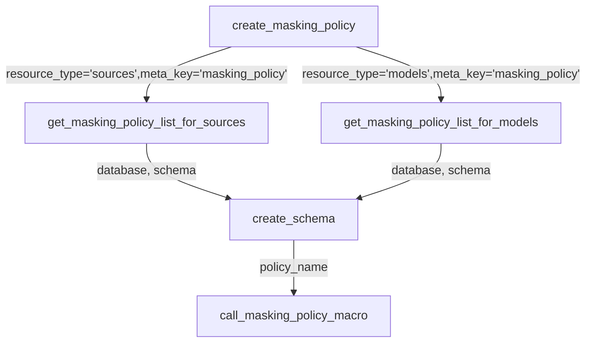
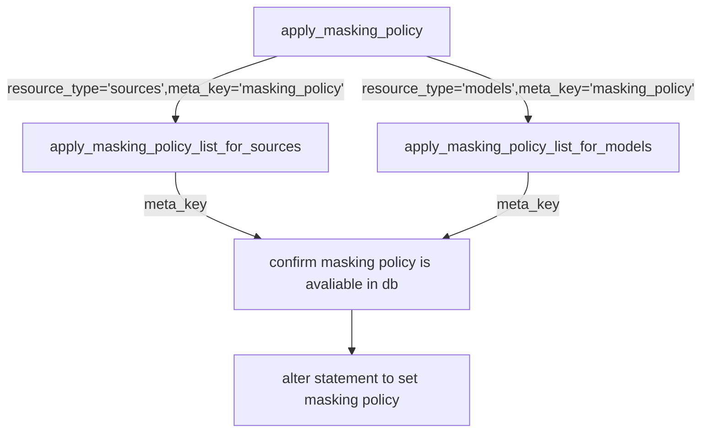

- [Overview](#overview)
- [Installation Instructions](#installation-instructions)
- [How to configure database and schema for the masking policy ?](#how-to-configure-database-and-schema-for-the-masking-policy-)
- [How to apply masking policy ?](#how-to-apply-masking-policy-)
- [How to remove masking policy ?](#how-to-remove-masking-policy-)
- [How to validate masking policy ?](#how-to-validate-masking-policy-)
- [Process flow](#process-flow)
  - [Create masking policy](#create-masking-policy)
  - [Apply masking policy](#apply-masking-policy)
- [Known Errors and Solutions](#known-errors-and-solutions)
- [Credits](#credits)
- [References](#references)
- [Contributions](#contributions)
- [How to do an integration test ?](#how-to-do-an-integration-test-)

# Overview
This dbt package contains macros that can be (re)used across dbt projects with snowflake. `dbt_snow_mask` will help to apply [Dynamic Data Masking](https://docs.snowflake.com/en/user-guide/security-column-ddm-use.html) using [dbt meta](https://docs.getdbt.com/reference/resource-properties/meta).

# Installation Instructions

- Add the package into your project.

  **Example** : packages.yml

  ```bash
     - git: "https://github.com/entechlog/dbt-snow-mask.git"
       revision: 0.1.7
  ```

  ```bash
     - package: entechlog/dbt_snow_mask
       version: 0.1.7
  ```

> ✅ Packages can be added to your project using either of above options  
> ✅ Please refer to the release version of this repo/dbt hub for the latest revision

- This package uses [dbt_utils](https://hub.getdbt.com/dbt-labs/dbt_utils/latest/) package. When using `dbt_snow_mask` in your project, please install [dbt_utils](https://hub.getdbt.com/dbt-labs/dbt_utils/latest/) as well. You will get an error if you attempt to use this package without installing `dbt_snow_mask`

  ```bash
     - package: dbt-labs/dbt_utils
       version: 0.8.2
  ```

> ✅ Please refer to the release version in dbt hub for the latest revision


# How to configure database and schema for the masking policy ?

By default this process creates the masking policies in same directory as the database objects. There are 2 methods for changing the default behavior by using the following parameters in your `dbt_project.yml` 

**Method 1 : Use a common database**

To change the database that your masking polices are created in set the following parameters:
* `use_common_masking_policy_db` (optional): Flag to enable the usage of a common db/schema for all masking policies. Valid values are “True” OR "False"
* `common_masking_policy_db` (optional): The database name for creating masking policies
* `common_masking_policy_schema` (optional): The schema name for creating masking policies
* `create_masking_policy_schema` (optional): Valid values are “True” OR "False". The default value is “True”. When set to "False", helps to avoid creating schema if the dbt role does not have access to create schema

**Example** : var block in dbt_project.yml to enable using a common masking policy database
```yaml
vars:
  use_common_masking_policy_db: "True"
  common_masking_policy_db: "DEMO_DB"
  common_masking_policy_schema: "COMPLIANCE"
```

**Method 2 : Use a common schema (in the current database)**

To change only the schema (so that a common masking policy schema is used in the same database as your model) set the following parameters:
* `use_common_masking_policy_schema_only` (optional): Flag to enable the usage of a common schema in the current database for all masking policies. Valid values are “True” OR "False"
* `common_masking_policy_schema` (optional): The schema name for creating masking policies
* `create_masking_policy_schema` (optional): Valid values are “True” OR "False". The default value is “True”. When set to "False", helps to avoid creating schema if the dbt role does not have access to create schema
  
**Example** : var block in dbt_project.yml to enable using a common masking policy schema (in the current database)

```yaml
vars:
  use_common_masking_policy_schema_only: "True"
  common_masking_policy_schema: "COMPLIANCE"
```

> ✅ If both `use_common_masking_policy_db` and `use_common_masking_policy_schema_only` are set to True, then `use_common_masking_policy_db` will supercede `use_common_masking_policy_schema_only`.

**Allow Custom Materializations**

To enable dbt_snow_mask to apply masking policies to models generated from custom materializations in dbt, configure the following parameter:
* `custom_materializations_map` (optional): A dictionary containing key-value pairs mapping custom materializations in dbt to the objects they generate in Snowflake. For each pair, the key must be the name of the custom_materialization and the value must be either `table` or `view`. 

**Example** : var block in dbt_project.yml to enable application of masking policies to a model generated using a custom materialiazition that ends up as a table in Snowflake.

```yaml
vars:
  custom_materializations_map: '{ "custom_incremental": "table" }'
```

# How to apply masking policy ?

- Masking is controlled by [meta](https://docs.getdbt.com/reference/resource-properties/meta) in [dbt resource properties](https://docs.getdbt.com/reference/declaring-properties) for sources and models. 

- Decide you masking policy name and add the key `masking_policy` in the column which has to be masked.
  
  **Example** : source.yml

  ```yaml
  sources:
    - name: raw_sakila
      tables:
        - name: customer
          columns:
            - name: first_name
              meta:
                  masking_policy: mp_encrypt_pii
  ```
  
  **Example** : model.yml

  ```yaml
  models:
    - name: stg_customer
      columns:
        - name: email
          meta:
            masking_policy: mp_encrypt_pii
  ```

- Create a new `.sql` file with the name `create_masking_policy_<masking-policy-name-from-meta>.sql` and the sql for masking policy definition. Its important for macro to follow this naming standard.
  
  **Example** : create_masking_policy_mp_encrypt_pii.sql

  ```sql
  

  CREATE MASKING POLICY IF NOT EXISTS {{node_database}}.{{node_schema}}.mp_encrypt_pii AS (val string) 
    RETURNS string ->
        CASE WHEN CURRENT_ROLE() IN ('ANALYST') THEN val 
             WHEN CURRENT_ROLE() IN ('DEVELOPER') THEN SHA2(val)
        ELSE '**********'
        END

  
  ```

> Its good to keep the masking policy ddl organized in a directory say `\macros\snow-mask-ddl`

- Create the masking policies by running below command  
  
| Resource Type | Command                                                                         |
| ------------- | ------------------------------------------------------------------------------- |
| sources       | `dbt run-operation create_masking_policy --args '{"resource_type": "sources"}'` |
| models        | `dbt run-operation create_masking_policy --args '{"resource_type": "models"}'`  |

- Alternatively, you can also create the masking policies by specifying `pre-hook` OR `on-run-start` in your `dbt_project.yml`
  
  ```yaml
  on-run-start:
    - "{{ dbt_snow_mask.create_masking_policy('models')}}"
    - "{{ dbt_snow_mask.create_masking_policy('sources')}}"
  ```

- Apply the masking policy by running below commands  

| Resource Type | Command                                                                        |
| ------------- | ------------------------------------------------------------------------------ |
| sources       | `dbt run-operation apply_masking_policy --args '{"resource_type": "sources"}'` |
| models        | `dbt run -- model <model-name>`                                                |
| snapshots     | `dbt snapshot --select <snapshot-name> --target <target-name>`                 |

- Alternatively, you can also apply the masking policies by specifying below `post-hook` OR `on-run-end` to `dbt_project.yml`
  
  **Example** : dbt_project.yml

(For models)
  ```yaml
  models:
    post-hook: 
      - "{{ dbt_snow_mask.apply_masking_policy('models') }}"
  ```
  
  (For snapshots)  
  ```yaml
  snapshots:
    post-hook: 
      - "{{ dbt_snow_mask.apply_masking_policy('snapshots') }}"
  ```

# How to remove masking policy ?

- Remove the masking policy applied by this package by running below commands  

| Resource Type | Command                                                                             |
| ------------- | ----------------------------------------------------------------------------------- |
| sources       | `dbt run-operation unapply_masking_policy --args '{"resource_type": "sources"}'`    |
| models        | `dbt run-operation unapply_masking_policy --args '{"resource_type": "models"}'`     |
| snapshots     | `dbt run-operation unapply_masking_policy --args '{"resource_type": "snapshots "}'` |

- Alternatively, you can also apply the unmasking policies by specifying below `post-hook` OR `on-run-end` to `dbt_project.yml`
  
  **Example** : dbt_project.yml

(For models)
  ```yaml
  models:
    post-hook: 
      - "{{ dbt_snow_mask.unapply_masking_policy('models') }}"
  ```
(For snapshots)
```yaml
  snapshots:
    post-hook: 
      - "{{ dbt_snow_mask.unapply_masking_policy('snapshots') }}"
  ```

# How to validate masking policy ?

```sql
-- Show masking policy
SHOW MASKING POLICIES;

-- Describe masking policy
DESCRIBE MASKING POLICY <masking-policy-name>;

-- Show masking policy references
USE DATABASE <database-name>;

USE SCHEMA INFORMATION_SCHEMA;

SELECT *
  FROM TABLE(INFORMATION_SCHEMA.POLICY_REFERENCES(POLICY_NAME => '<database-name>.<schema-name>.<masking-policy-name>'));
```

# Process flow
## Create masking policy



## Apply masking policy



# Known Errors and Solutions
| Error                                                               | Solution                                                                 |
| ------------------------------------------------------------------- | ------------------------------------------------------------------------ |
| dict object' has no attribute 'create_masking_policy_mp_encrypt_pi' | Typo in yaml for masking_policy, mp_encrypt_pi instead of mp_encrypt_pii |

# Credits
This package was created using examples from [Serge](https://www.linkedin.com/in/serge-gekker-912b9928/) and [Matt](https://www.linkedin.com/in/matt-winkler-4024263a/). Please see the [contributors](https://github.com/entechlog/dbt-snow-mask/graphs/contributors) for full list of users who have contributed to this project.

# References
- https://docs.snowflake.com/en/user-guide/security-column-ddm-intro.html
- https://getdbt.slack.com/archives/CJN7XRF1B/p1609177817234800
- https://docs.snowflake.com/en/sql-reference/functions/policy_references.html
- https://docs.snowflake.com/en/user-guide/security-column-ddm-use.html

# Contributions
Contributions to this package are welcomed. Please create issues for bugs or feature requests for enhancement ideas or PRs for any enhancement contributions.

# How to do an integration test ?
- This is applicable only to contributors
- cd into `dbt-snow-mask/integration_tests`
- Run `dbt deps`
- Run `dbt seed`
- Adjust the vars in `integration_tests\dbt_project.yml` and run `dbt run` 
